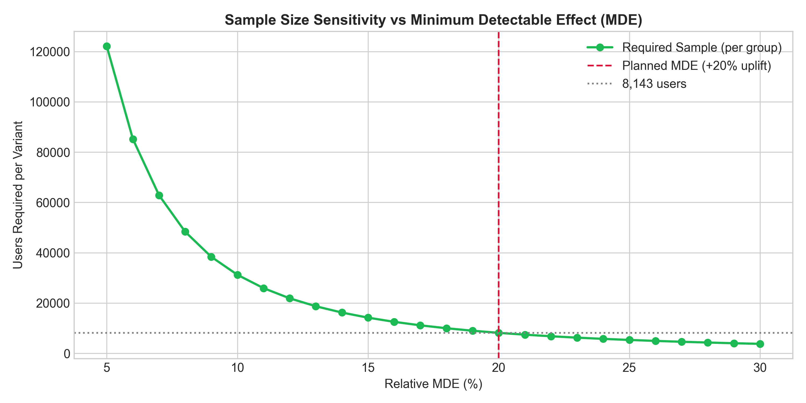
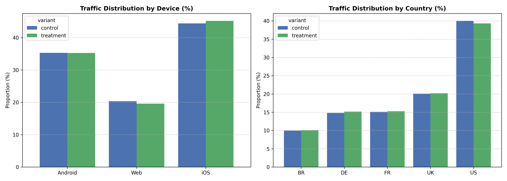
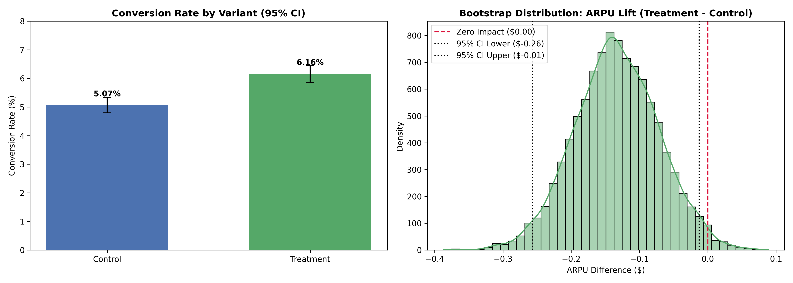

# Product Monetization A/B Testing Engine

An end-to-end experiment design, sample sizing, data integrity audit, and hypothesis testing pipeline analyzing ~50,000 checkout events for pricing and conversion rate optimization (CRO).

---

## 🏗️ Repository Architecture

```text
product-ab-testing-engine/
├── README.md
├── requirements.txt
├── generate_data.py
├── .gitignore
├── assets/
│   ├── power_analysis_curve.png
│   ├── srm_segment_checks.png
│   └── monetization_results_summary.png
├── data/
│   └── ab_test_monetization_raw.csv
└── notebooks/
    ├── 01_power_analysis_sample_sizing.ipynb
    ├── 02_data_integrity_srm_check.ipynb
    └── 03_hypothesis_testing_revenue_analysis.ipynb
```

---

## 📊 Experimentation Stages

### 1. Pre-Experiment Power Analysis & Sample Sizing
* Calculated **Cohen's h** effect size for proportion differences.
* Set power at $1 - \beta = 0.80$ and significance level $\alpha = 0.05$.
* Estimated minimum required sample size of **8,143 users per variant** to reliably detect a $+20\%$ relative Minimum Detectable Effect (MDE).
* Mapped sensitivity curves to project required experiment runtime against traffic volumes.



### 2. Data Integrity & Sample Ratio Mismatch (SRM) Audit
* Conducted Chi-Square ($\chi^2$) Goodness-of-Fit test on a 50/50 planned split ($\chi^2 = 0.2247, p = 0.6355$), confirming no allocation bias.
* Verified balance across key operational segments (iOS, Android, Web, and 5 global markets).
* Audited user uniqueness and missing values across all 50,000 records.



### 3. Hypothesis Testing & Revenue Analysis
* **Conversion Rate (Two-Sample Z-Test):** Treatment achieved $+21.55\%$ relative uplift ($5.07\% \to 6.16\%, p < 10^{-6}$).
* **ARPU & Revenue Impact (Welch's T-Test & 10,000 Bootstrap Resampling):** ARPU declined by $-7.99\%$ ($\$1.683 \to \$1.548$, 95% CI $[-\$0.257, -\$0.013], p = 0.0315$).
* **Business Takeaway:** Lower entry-tier pricing increased user acquisition but diluted average order value, leading to net revenue cannibalization.



---

## 🚀 Quickstart

```bash
# Clone repository
git clone [https://github.com/rfilipeuk/product-ab-testing-engine.git](https://github.com/rfilipeuk/product-ab-testing-engine.git)
cd product-ab-testing-engine

# Create environment and install dependencies
conda create -n abtest-env python=3.10 -y
conda activate abtest-env
pip install -r requirements.txt

# Run analytical workflow
jupyter notebook
```
